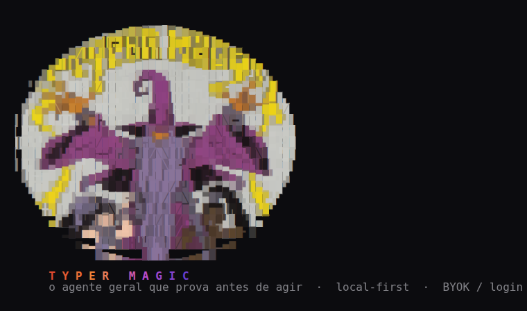

<!-- [English](./README.md) | 🌐 Português -->

<p align="center">
  
</p>

<h1 align="center">TYPER Magic</h1>

<p align="center"><em>O agente geral em que você confia sistemas e dados de verdade — porque ele prova antes de agir.</em></p>

<p align="center">
  
</p>

---

O TYPER Magic é um **agente local-first, BYOK e agnóstico de modelo** na classe do Hermes e
do OpenClaw — um **agente geral e autônomo**, não uma ferramenta só de código. Ele opera
sistemas e dados de verdade: escreve e entrega código, roda e supervisiona comandos, navega
na web, automatiza e vigia seus servidores, raciocina sobre seus arquivos e se aprimora a
partir de skills assinadas. Você o controla de um terminal, de um editor, de um chat
(Telegram) ou no agendador. Escrever código é uma das coisas que ele faz — não o todo do
que ele é.

Ele é construído em torno de uma regra dura: **toda ação com efeito real passa por um portão
de verificação antes de acontecer.** Ele iguala o alcance, a autonomia e a auto-melhoria dos
agentes populares — e põe tudo isso atrás de um **selo**: mudanças de código viram de
*rejeitado* para *verificado* só quando a suíte de testes passa, e uma ação externa
irreversível nunca roda sozinha.

> A maioria dos agentes ganha em alcance e autonomia e deixa a mesma ferida aberta: não
> conseguem dizer "essa ação é segura antes de eu executar", e uma skill de terceiro pode
> exfiltrar seu dado sem você perceber. O TYPER Magic fecha essa classe de problema por
> construção.

## Por que é diferente

- **Geral, não só código.** O mesmo agente escreve código, roda e supervisiona comandos,
  navega, monitora e conserta um servidor por chat, executa tarefas agendadas e relembra do
  seu vault de memória. Código é uma superfície de um sistema que opera o que você conceder.
- **O selo — generalizado.** Mudanças de código são gateadas pela sua suíte de testes
  (nada vai ao disco sem passar, e reverte sozinho na falha). Ações de efeito externo são
  gateadas por política + dry-run, e as irreversíveis pedem um selo humano — ou, numa
  superfície autônoma (scheduler, gateway), **escalam em vez de executar**.
- **Menor privilégio por superfície.** Cada uma das 50 ferramentas carrega uma `permission`
  (`read`/`write`/`exec`/`network`/`meta`) e um contexto de `exec`
  (`in_process`/`subprocess`/`microvm`). Um **broker de capacidade** casa cada ferramenta
  com o grant da superfície *antes* do dispatch — confiança total no seu terminal,
  default-deny para o que vem de um chat, de um agendamento ou de uma skill importada.
- **Defesa de prompt injection.** Conteúdo não confiável (páginas web, arquivos, saída de
  ferramenta) nunca entra no canal de instrução — é dado a processar, nunca ordem a obedecer.
- **Tudo assinado.** Skills carregam assinatura Ed25519 e um manifesto de capacidade;
  importar uma mostra um **diff** de capacidade, põe em quarentena e roda confinada — skill
  não assinada ou adulterada não carrega. As execuções saem como **trajetórias assinadas e
  reproduzíveis** que você verifica e transforma em dado de treino.
- **Memória estilo Obsidian, mais leve.** Um vault markdown file-based com wikilinks
  `[[ ]]`, backlinks automáticos, tags, um grafo navegável e recall híbrido (semântico +
  caminhada no grafo + léxico). Cada entrada carrega procedência e confiança; o recall
  prefere o que é verificado.
- **Um motor, várias superfícies.** Uma **Engine API** estável move uma CLI/TUI standalone,
  um editor de código, um **gateway de mensagens** (Telegram, capability-scoped por
  remetente), um **scheduler/daemon** e um **handler serverless** — todos falando a mesma
  fachada.

## Arquitetura

```
Superfícies:  CLI/TUI ─┐  Editor ─┐  Gateway (Telegram) ─┐  Scheduler ─┐  Serverless ─┐
                       ▼          ▼                       ▼            ▼              ▼
                        Engine API  (@typer/engine)  ← fachada estável
                            │  runTask() em stream de eventos + primitivas
                            ▼
   Núcleo:  router · retrieval · index · memory · handoff · skills · selo · agent (50 tools)
            crypto · sandbox · trajectory · mcp · cost
                            │
        Espinha de segurança: broker de capacidade · policy gate (efeitos externos)
                              selo por classe de ação · skills e trajetórias assinadas
```

O núcleo nunca sabe qual modelo está atrás nem qual superfície está na frente. Trocar de
modelo é trocar um adaptador, não a arquitetura.

## Começo rápido

```bash
pnpm install
pnpm --filter @typer/agent-cli build      # builda a CLI `typermagic` (e `typer-agent`)

# offline (sem chave) cai num provider Fake determinístico
typermagic tools          # as 50 ferramentas, com permissão/exec
typermagic memory         # o grafo de memória (ascii)
typermagic                # REPL interativo (o banner acima)
```

### Entrar (login)

No REPL, é só digitar **`/login`** — abre um menu (chave de API ou assinatura, Anthropic
ou OpenAI) e você escolhe. Pelo shell:

```bash
typermagic login                 # interativo: chave de API ou assinatura, escolhe o provider
typermagic auth set anthropic    # cola uma API key (BYOK)  ·  ou export TYPER_ANTHROPIC_KEY=...
typermagic login anthropic       # entra com sua assinatura Claude Pro/Max (OAuth)
typermagic login openai          # entra com sua assinatura ChatGPT Plus/Pro (OAuth)
typermagic auth status           # o que está logado   ·   no REPL: /status, /logout <provider>
```

> O login por assinatura usa o OAuth oficial dos provedores (igual Claude Code / Codex) e
> consome o SEU plano — é zona cinzenta dos termos deles. BYOK (uma API key) não tem esse
> risco. Os tokens ficam locais em `~/.typer/auth.json` (modo `0600`) e renovam sozinhos.

### Pôr pra trabalhar

```bash
typermagic run --test "pnpm test" "corrija o bug em src/x.ts"   # edita, gateado pelos seus testes
typermagic chat "explique este repo"                            # perguntas (somente-leitura) sobre o código
typermagic gateway telegram        # controle por chat (TYPER_TELEGRAM_TOKEN)
typermagic schedule daemon         # tarefas agendadas autônomas (irreversível ainda gateado)
typermagic trajectory export       # logs assinados e reproduzíveis → dataset
```

## Estado

A fundação **e a camada de autonomia** estão de pé e testadas (374 testes): a Engine API, a
CLI/TUI standalone, a memória estilo Obsidian com visualização em grafo, a espinha de
segurança (broker de capacidade + policy gate para efeitos externos + selo por classe de
ação), isolamento real por subprocess (Firecracker opt-in atrás de um driver `MicroVm`), um
gateway de mensagens capability-scoped (Telegram, allowlist + rate-limit por remetente), um
registry de skill assinado com capability diff + quarentena + revogação na importação, um
scheduler daemon e um handler serverless, e export de trajetória assinada e reproduzível
alimentando o pipeline de fine-tune. Canais ao vivo, isolamento por microVM e deploy
serverless acendem com a sua infra (BYO-token / credenciais) — nunca são exigidos para rodar
ou testar o núcleo.

## Licença

[Apache-2.0](./LICENSE). Os comentários do código são em português do Brasil — um
invariante do projeto.
